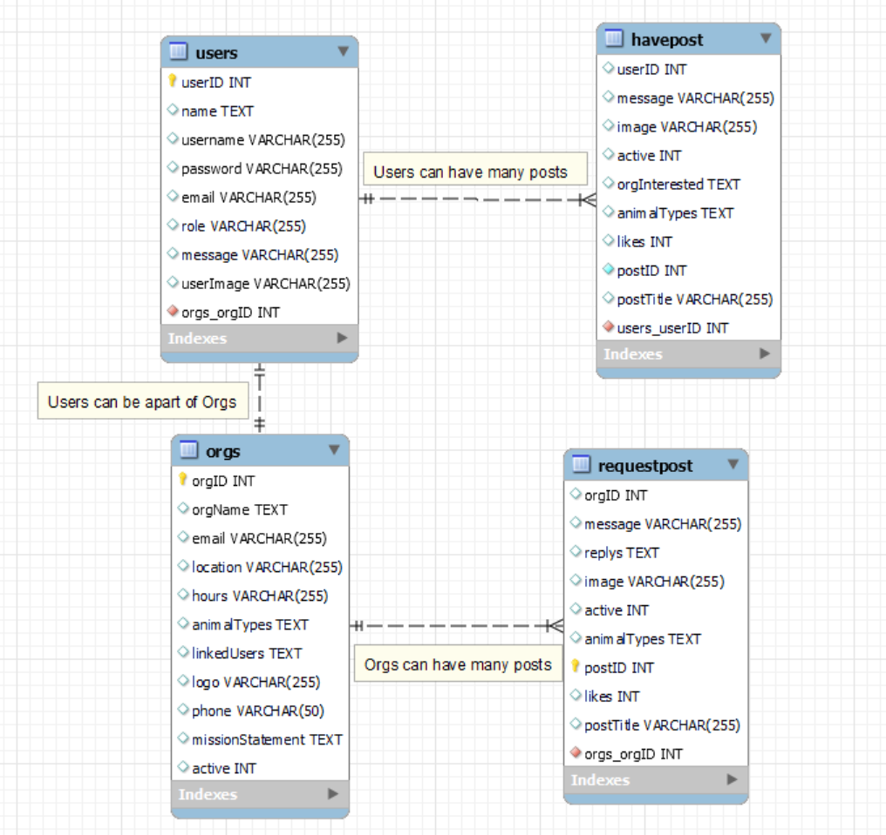
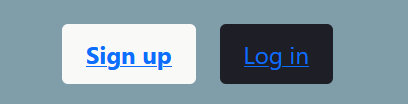
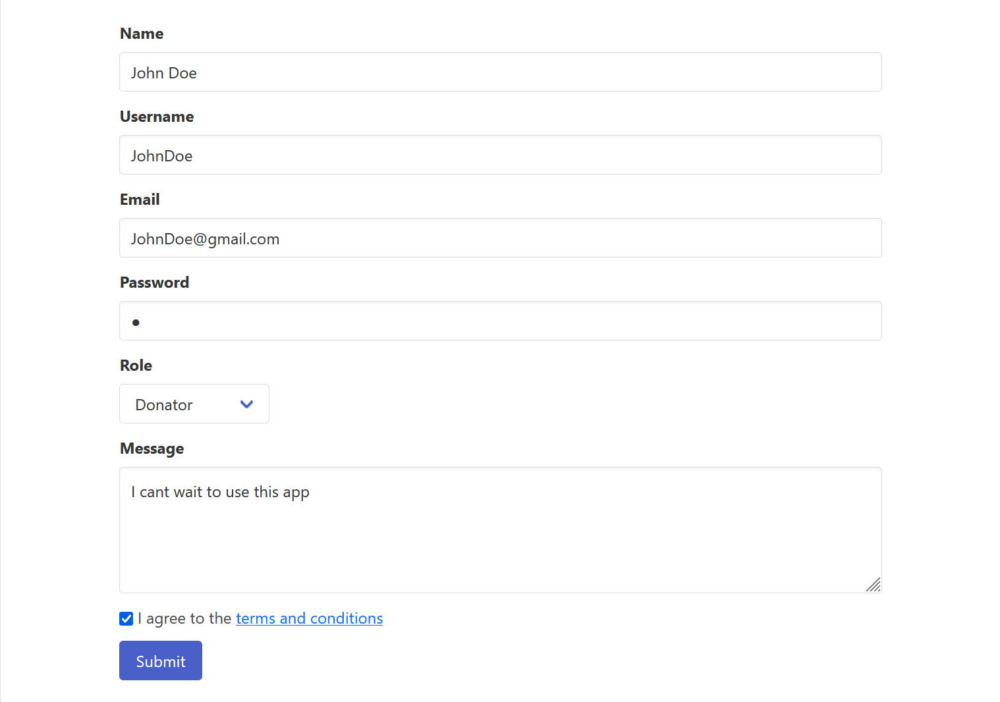
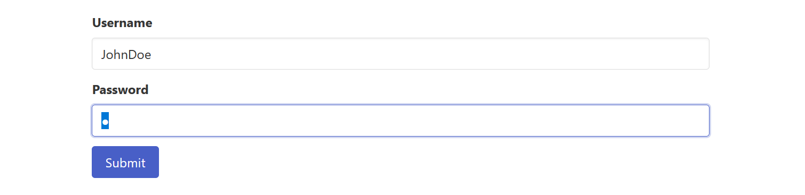
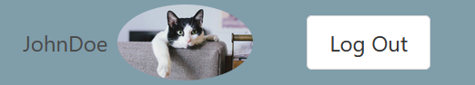
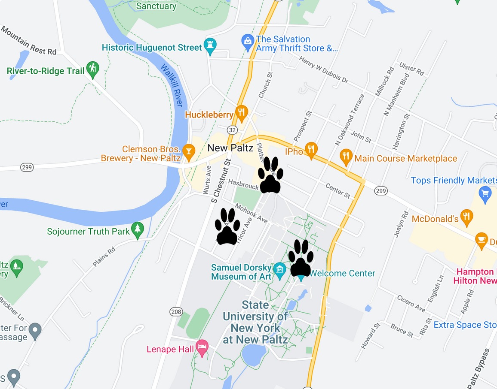
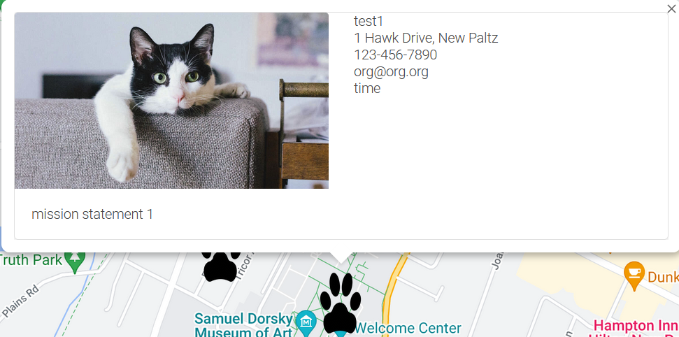
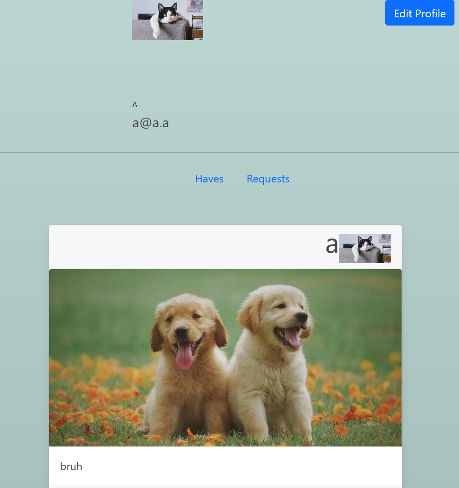
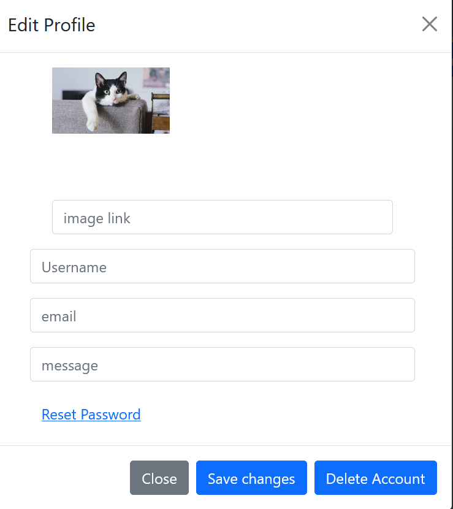

# Shelter Helper
This is a web application that helps people find shelters in their area, see what the local shelters need, and share posts with the local shelters.
## User 
The user is able to create an account, and login to the application. The user can also create a post, and see the posts that are posted by the local shelters and other users.

## Status
The application is currently in development.

## Future
There are many things still needing to be done to the application. On the front end the site needs to be polished up and the user interface needs to be improved. On the back end the application needs to be updated to be more efficient and to be more secure. As well as adding new features like followers/following, and creating better profile/control page for the shelter. Admin Panel and user management needs to be added as well.

# Current Bugs
As the application is currently in development, there are currently are a few bugs that need to be fixed.
### On the front end
- No currently known bugs

### On the back end
- Issues with loading certain usernames on the posts
# Technologies Used
There were many technologies used in this project.
## Front end
* Vue.js
* Javascript
* Bootstrap 5
* CSS
* HTML
## Back end
* Node.js
* Express.js
* MySQL
## APIs
* Google Maps API
* VueGoogleMaps
* PositionStack API

# ERD

## Users
This table holds all the users that are registered in the application.

## Have Posts
The Have Posts table holds all the posts that are created by the users. These are for the shelters to see what people are trying to give away.
## Orgs 
This table holds all the organizations that are registered in the application.
## Request Posts
The Request Posts table holds all the posts that are created by the shelters. These are for the users to see what the shelters are trying to get.

# Usage
## Running the application
After cloning or downloading the project you can run the server by using:  
>`npm start`   

The application will be running on:  
>`http://localhost:3100` 

If you want to start the development server you can use: 
>`cd client` 

Then:  
>`npm run serve` 

The application will be running on:  
>`http://localhost:8080` 

## Variables/Other
The following are the variables that are used in the application:

### Server side
- PORT: The port that the application will be running on.
- SQL_DB_USER: The username for the database.
- SQL_DB_PASSWORD: The password for the database.
### Client side
- VUE_APP_GOOGLE_MAPS_API_KEY: The API key for the Google Maps API.
- VUE_APP_SQL_DB_USER: The username for the database.
- VUE_APP_SQL_DB_PASSWORD: The password for the database.
- VUE_APP_ZIP_CODE_KEY: The API key for the Zip Code API. ( PositionStack )

# Screenshots
## New User process
> The process of signing up and logging in to the application.

  

  

  

  

## Shelter Locator
> The proccess of searching for shelters in the area. The registered shelters are shown.

  

  

## Profile
> The profile page for the user.

  

> The user can edit their info

  

